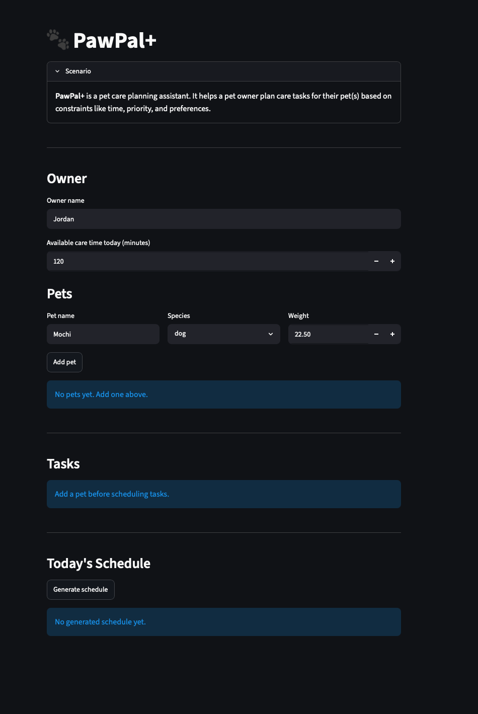

# PawPal+ (Module 2 Project)



You are building **PawPal+**, a Streamlit app that helps a pet owner plan care tasks for their pet.

## Scenario

A busy pet owner needs help staying consistent with pet care. They want an assistant that can:

- Track pet care tasks (walks, feeding, meds, enrichment, grooming, etc.)
- Consider constraints (time available, priority, owner preferences)
- Produce a daily plan and explain why it chose that plan

Your job is to design the system first (UML), then implement the logic in Python, then connect it to the Streamlit UI.

## What you will build

Your final app should:

- Let a user enter basic owner + pet info
- Let a user add/edit tasks (duration + priority at minimum)
- Generate a daily schedule/plan based on constraints and priorities
- Display the plan clearly (and ideally explain the reasoning)
- Include tests for the most important scheduling behaviors

## Features

- **Priority-based scheduling:** Sorts pending pet care tasks by effective priority, then by date, time, pet name, and task type for predictable schedule order.
- **Medication priority boost:** Gives medication tasks extra scheduling weight so they are less likely to be skipped when the owner has limited care time.
- **Chronological sorting:** Displays tasks in calendar order by date and time, independent of priority.
- **Pet and status filtering:** Filters tasks by selected pet and by status, including `pending`, `complete`, and `skipped`.
- **Recurring task generation:** Expands daily or weekly recurring tasks into future scheduled tasks using `timedelta`.
- **Conflict detection:** Detects overlapping pending tasks on the same date by comparing each task's start time and duration.
- **Pre-add conflict warnings:** Checks a new task against existing tasks before adding it and warns the user if the new task overlaps.
- **Availability-aware planning:** Builds a daily schedule that fits within the owner's available care minutes.
- **Skipped task reporting:** Reports tasks that were not included in the generated schedule because they exceeded the available time budget.
- **Task status management:** Allows tasks to be marked as pending, complete, or skipped, and excludes completed/skipped tasks from schedule planning and conflict detection.
- **Owner/pet ownership validation:** Ensures owners can only schedule tasks for pets they own.

## Getting started

### Setup

```bash
python -m venv .venv
source .venv/bin/activate  # Windows: .venv\Scripts\activate
pip install -r requirements.txt
```

### Suggested workflow

1. Read the scenario carefully and identify requirements and edge cases.
2. Draft a UML diagram (classes, attributes, methods, relationships).
3. Convert UML into Python class stubs (no logic yet).
4. Implement scheduling logic in small increments.
5. Add tests to verify key behaviors.
6. Connect your logic to the Streamlit UI in `app.py`.
7. Refine UML so it matches what you actually built.

## 🖥️ Sample Output

Paste a sample of your app's CLI or Streamlit output here so a reader can see what a generated plan looks like:

```
# e.g.:
# Daily plan for Biscuit (Golden Retriever):
#   08:00 — Morning walk (30 min) [priority: high]
#   09:00 — Feeding (10 min) [priority: high]
#   ...
```

## 🧪 Testing PawPal+

Run the full test suite with:

```bash
python -m pytest
```

Run with coverage:

```bash
pytest --cov
```

## Testing PawPal ++

The tests cover the most important PawPal+ scheduling behaviors:

- Sorting correctness: verifies chronological ordering by date, time, pet name, and task type so tied tasks appear in a predictable order.
- Recurrence logic: verifies daily and weekly recurring tasks expand into the expected future dates and generated follow-up tasks do not accidentally keep recurring forever.
- Conflict detection: verifies overlapping pending tasks are reported, while completed tasks, tasks on different dates, and back-to-back tasks are ignored.
- Availability planning: verifies high-priority care tasks are selected first and tasks that do not fit in the owner's available care time are reported as skipped.
- Ownership rules: verifies owners only schedule tasks for pets they own.

Successful output from `python -m pytest`:

```text
============================= test session starts ==============================
platform darwin -- Python 3.13.5, pytest-9.1.1, pluggy-1.6.0
rootdir: /Users/sebastianbejaoui/Desktop/Software projects/AI 101/ai110-module2show-pawpal-starter
plugins: anyio-4.10.0
collected 15 items

test_paypal.py ..                                                        [ 13%]
tests/test_pawpal_system.py .............                                [100%]

============================== 15 passed in 0.02s ==============================
```

## 📐 Smarter Scheduling

PawPal+ now includes scheduling logic that goes beyond simply storing tasks. The core algorithms live in `pawpal_system.py`, and the Streamlit UI in `app.py` exposes them through task controls, filters, warnings, and schedule views.

| Feature | Method(s) | What it does |
|---------|-----------|--------------|
| Priority-based schedule sorting | `Task.sort_tasks()`, `Scheduler.build_daily_plan()`, `_priority_sort_key()` | Orders pending tasks by effective priority, then date, time, pet name, and task type for stable results. |
| Medication priority boost | `_effective_priority()` | Gives medication tasks an internal priority boost so they are less likely to be skipped when available care time is limited. |
| Chronological sorting | `Task.sort_tasks_by_time()`, `_chronological_sort_key()` | Sorts tasks by date and time without considering priority, useful for viewing the day in order. |
| Filter by pet and status | `Task.filter_tasks()`, `Scheduler.get_filtered_tasks()` | Returns only tasks for a selected pet and/or status such as `pending`, `complete`, or `skipped`. |
| Task status updates | `ScheduledTask.mark_complete()`, `ScheduledTask.mark_skipped()` | Tracks whether a care task is still pending, completed, or intentionally skipped. |
| Recurring tasks | `Scheduler.create_recurring_tasks()`, `Owner.add_task_series()` | Expands a task into additional daily or weekly due dates. Daily recurrence uses `date.today() + timedelta(days=1)` for the next due date. |
| Conflict detection | `Scheduler.find_conflicts()`, `Scheduler.conflicts_for_task()` | Detects overlapping pending tasks on the same date using each task's start time and duration. |
| Availability-aware planning | `Scheduler.build_daily_plan()`, `Owner.view_schedule()` | Builds a plan that fits inside the owner's available care minutes. |
| Skipped-task reporting | `Scheduler.build_daily_plan_details()`, `Owner.view_schedule_details()` | Returns both the selected plan and tasks skipped because they did not fit within the available time. |
| Owner/pet task ownership | `Scheduler.get_tasks_for_owner_pets()`, `Owner.add_task()` | Keeps generated schedules limited to tasks for pets owned by the current owner. |

The app uses these methods to show current task filters, warn about conflicts before and after adding tasks, generate recurring task instances, and display the final schedule as a table, by pet, or by time block.

## 📸 Demo Walkthrough

Follow these steps to try the Streamlit demo:

1. Start the app with `streamlit run app.py`.
2. In the **Owner** section, enter the owner's name and set **Available care time today**. This time budget controls which pending tasks fit into the generated schedule.
3. In the **Pets** section, enter a pet name, species, and weight, then click **Add pet**. The pet table updates with the pet's task count.
4. In the **Tasks** section, choose the pet, task type, time, date, duration, priority, repeat option, and reason. Click **Add task** to create the scheduled task. If the task overlaps another pending task, the app shows a warning and a conflict table.
5. To test recurring tasks, set **Repeat** to `daily` or `weekly` and choose an **Additional repeats** value before clicking **Add task**. PawPal+ creates the original task plus generated future tasks.
6. Use **Filter by pet**, **Filter by status**, and **Sort tasks** to view a focused task list. The **Scheduler views** tabs show the same tasks as filtered results, priority order, chronological order, and conflict checks.
7. Use **Task to update** and **New status** to mark a task as `pending`, `complete`, or `skipped`. Completed and skipped tasks are excluded from conflict detection and daily planning.
8. Click **Generate schedule** in **Today's Schedule**. The app builds an availability-aware plan using the scheduler, then displays the result as a table, by pet, or by time block.
9. If every pending task fits, the app shows a success message. If some tasks exceed the owner's available care time, the skipped-task table explains which tasks were left out.

Sample CLI output from `python3 main.py`:

```text
Today's Schedule
================
09:15 - Luna: Meds (5 min, priority 3)
08:00 - Mochi: Feeding (10 min, priority 3)
12:30 - Mochi: Walk (30 min, priority 2)
17:00 - Luna: Enrichment (20 min, priority 1)
```

**Screenshot or video** *(optional)*: Add a screenshot of the generated schedule table or conflict warning here.
