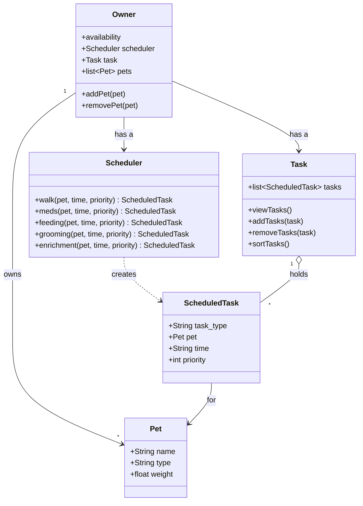

# PawPal+ UML Class Diagram (Revision)

```mermaid
classDiagram
    class Pet {
        +String name
        +String type
        +float weight
    }

    class ScheduledTask {
        +String task_type
        +Pet pet
        +String time
        +int priority
    }

    class Scheduler {
        +walk(pet, time, priority) ScheduledTask
        +meds(pet, time, priority) ScheduledTask
        +feeding(pet, time, priority) ScheduledTask
        +grooming(pet, time, priority) ScheduledTask
        +enrichment(pet, time, priority) ScheduledTask
    }

    class Task {
        +list~ScheduledTask~ tasks
        +viewTasks()
        +addTasks(task)
        +removeTasks(task)
        +sortTasks()
    }

    class Owner {
        +availability
        +Scheduler scheduler
        +Task task
        +list~Pet~ pets
        +addPet(pet)
        +removePet(pet)
    }

    Owner "1" --> "*" Pet : owns
    Owner --> Scheduler : has a
    Owner --> Task : has a
    Scheduler ..> ScheduledTask : creates
    Task "1" o-- "*" ScheduledTask : holds
    ScheduledTask --> Pet : for
```
